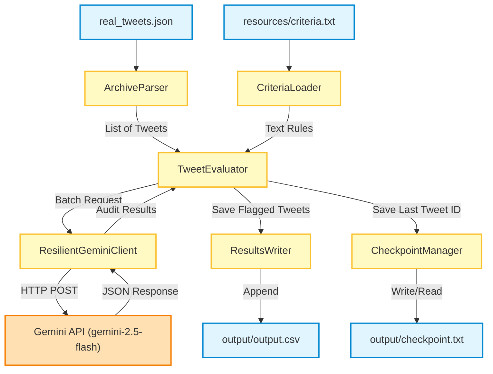

# Tweet Audit

A lightweight, local Java CLI application that audits your historical Twitter/X archive against customizable content criteria using Google's Gemini AI. It identifies and flags tweets that violate your specified guidelines (such as unprofessional language, outdated opinions, political posts, etc.) and generates a CSV report with tweet URLs for easy manual deletion.

---

## Key Features

- **Local Archive Parsing**: Parses your `real_tweets.json` or standard Twitter archive format, removing JS prefixes automatically.
- **Customizable Alignment Criteria**: Define your auditing rules in a simple text file (`resources/criteria.txt`).
- **Resilient AI Auditing**: Leverages Gemini models (e.g., `gemini-2.5-flash`) via the Gemini Developer API with robust error handling and **exponential backoff retries** for rate limits (429) and server errors.
- **Automatic Checkpointing**: Saves progress to `output/checkpoint.txt` after every batch. If the process is stopped or crashes, it resumes exactly where it left off, avoiding duplicate API calls and charges.
- **CSV Output Report**: Generates a clean `output.csv` listing flagged tweets, the specific reason they were flagged, and direct links to the tweets for quick manual review and deletion.
- **Safe & Private**: Operates entirely locally. Does NOT connect to the X/Twitter API and does NOT perform automatic deletions.

---

## System Architecture

The following diagram illustrates how the components of the Tweet Audit Tool interact to process your archive:



---

## Project Structure

```text
tweet-audit/
├── src/
│   └── main/
│       └── java/
│           └── com/mycompany/tweet/audit/
│               ├── TweetAudit.java           # Application entry point
│               ├── api/
│               │   ├── GeminiClient.java     # Base HTTP API requests
│               │   └── ResilientGeminiClient.java # Handles retries & backoff
│               ├── config/
│               │   └── CriteriaLoader.java   # Loads criteria.txt rules
│               ├── evaluator/
│               │   └── TweetEvaluator.java   # Orchestrates batching and workflow
│               ├── model/
│               │   ├── AuditResult.java      # Model for Gemini response
│               │   ├── Tweet.java            # POJO for raw Tweet data
│               │   └── ...                   # Gemini request representation classes
│               ├── output/
│               │   └── ResultsWriter.java    # Appends flagged results to CSV
│               └── utility/
│                   ├── BatchSplitter.java    # Helper for batching tweets
│                   └── CheckpointManager.java# Manages checkpointing state
├── resources
│   └── criteria.txt                          # Alignment rules (one per line)
├── output/                                   # Automatically generated output folder
│   ├── output.csv                            # List of flagged tweets
│   └── checkpoint.txt                        # Last processed tweet ID
├── .env                                      # Local environment configuration
├── pom.xml                                   # Maven dependencies & build configuration
└── data/tweets.json                          # Tweet archive JSON (gitignored)
```

---
### Prerequisites

- **Java JDK 24** (or compatible 21+ version)
- **Maven** (for compiling and dependency management)
- A **Gemini API Key** (Get one from [Google AI Studio](https://aistudio.google.com/))

### Installation & Setup

1. **Clone or copy this repository** to your local system.
2. In the project root directory, create a `.env` file (or edit the existing one) with the following environment variables:

```env
GEMINI_API_KEY=your_gemini_api_key_here
X_USERNAME=your_twitter_username_here
BATCH_SIZE=10
GEMINI_MODEL=gemini-2.5-flash
```

3. Configure your audit criteria in `resources/criteria.txt`. Each line represents a rule you want Gemini to flag. For example:
   ```text
   Unprofessional language or extreme profanity.
   Hate speech or discriminatory remarks.
   Opinions about politics or religion.
   Complaints about previous employers.
   Outdated professional opinions.
   Keywords with crypto, NFT, thirst or Simp posts.
   ```

4. Place your exported Twitter archive JSON file in a folder called `data` in the project root directory and name it `tweets.json`.
   > [!NOTE]
   > The tool automatically strips out any prefix like `window.YTD.tweets.part0 = ` from the archive file, making it directly compatible with standard Twitter export files.

---

## Running the Application

To compile the application and run the audit, use the following Maven command:

```bash
mvn clean compile exec:java
```

### What happens during execution:
1. **Archive Parsing**: The tool loads and parses your `tweets.json`.
2. **Checkpoint Checking**: If a checkpoint is detected in `output/checkpoint.txt`, the application skips all previously successfully processed tweets and resumes evaluation from the next tweet.
3. **Batch Evaluation**: The application groups tweets into batches (size configurable via `BATCH_SIZE`) and submits them to Gemini.
4. **Resilient Retries**: If rate limits (HTTP 429) or transient errors occur, the tool pauses and retries with exponential backoff.
5. **Auto-Saving Results**: Flagged tweets are appended to `output/output.csv` after each batch, and `output/checkpoint.txt` is updated with the last processed tweet's ID.
6. **Rate-Limit Breathing**: The tool pauses for 15 seconds after every batch execution to prevent hitting standard Gemini rate limits.

---

## Output Format

### Flagged Tweets (`output/output.csv`)
If a tweet is flagged as violating your criteria, it is saved in a comma-separated format:
```csv
Tweet ID,Tweet,Reason,URL
1234567890,"Had a terrible day at work today...","Complaints about previous employers",https://x.com/your_username/status/1234567890
```

### Checkpoint Log (`output/checkpoint.txt`)
Contains a single value: the ID of the last successfully processed tweet (e.g., `1234567890`). Delete this file if you wish to restart the audit from the beginning.
```text
1234567890
```

---


## Security & Privacy

- **No Uploads**: The application processes your archive locally. Only the text contents of the tweets being audited are sent to the Gemini API endpoint.
- **Safety First**: Since the application does not have write access to your Twitter account (and does not ask for or use Twitter API keys), your archive and account are entirely safe from accidental edits or deletions.


## Code Quality & Best Practices

- **Modular Design**: The application is structured into clear modules(API client, evaluator, output writer, etc.) for maintainability and scalability.
- Java 25 features are utilized for improved performance and cleaner syntax.
- **Error Handling**: Comprehensive error handling ensures that the application can recover gracefully from API errors, network issues, or unexpected input formats.

See [TRADEOFFS.md](./TRADEOFFS.md) for more details on design decisions.
